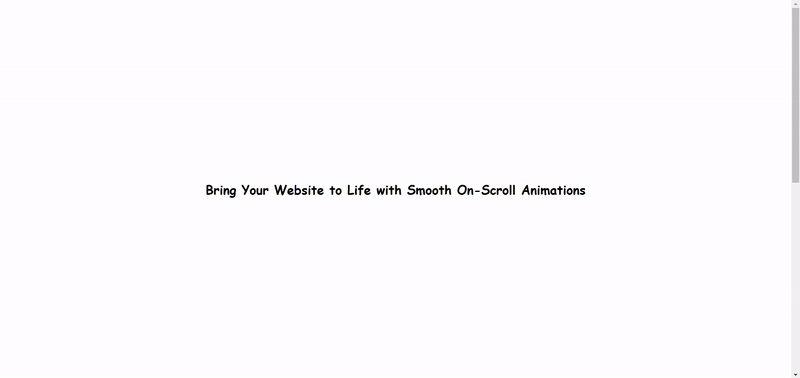
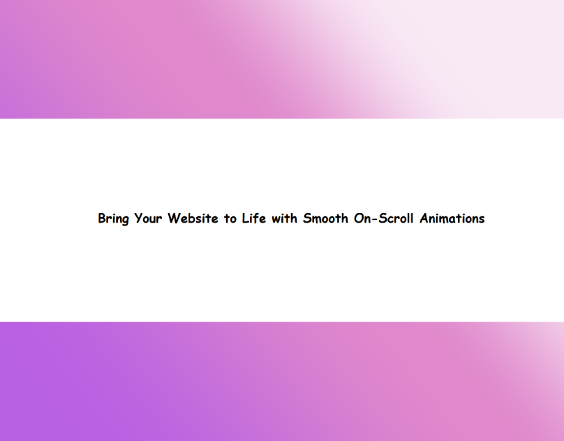

# ScrollMotion: Unlock the Power of Seamless On-Scroll Animations

<a href="https://www.linkedin.com/in/dharmendraverma95/" target="_blank">LinkedIn Profile </a>

<a href="https://www.behance.net/dhirukumar" target="_blank">Behance Profile </a>

## Overview
ScrollMotion is a lightweight and customizable library that enables smooth on-scroll animations for your website. Enhance user experience with engaging animations that trigger as users scroll through the page, making your site feel more interactive and dynamic.

### Features
<ul>
  <li>Easy Integration: Add animations to your website with minimal setup.

</li>
  <li>Customizable: Adjust animation speed, effects, and trigger points to fit your design needs</li>
  <li>Performance Optimized: Lightweight and efficient, ensuring a smooth experience across all devices.
</li>
<li>Mobile-Friendly: Fully responsive and works seamlessly on all screen sizes.
</li>
</ul>

# Preview

ScrollMotion: On-Scroll Animations 
 

 
 
Cover 
 

 
###### Lang
<ul>
  <li>Graphic Design Software: Adobe Illustrator, Photoshop, Figma (for mockups)</li>
  <li>Web Tools (Optional): HTML, CSS for any digital presentations or landing pages</li>
  <li>Font Awesome (Optional for icons)</li>

</ul>

